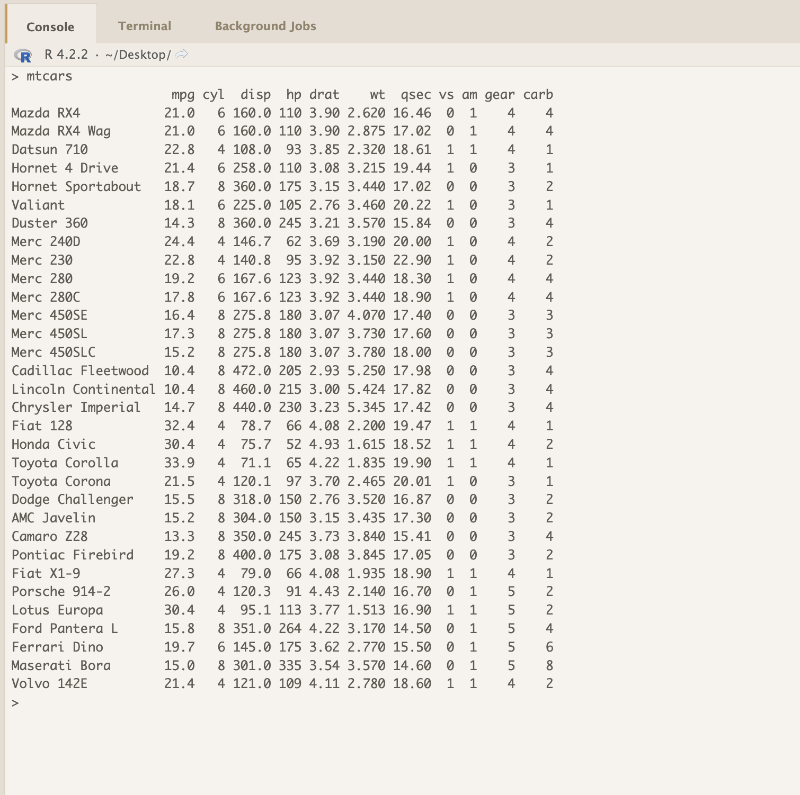
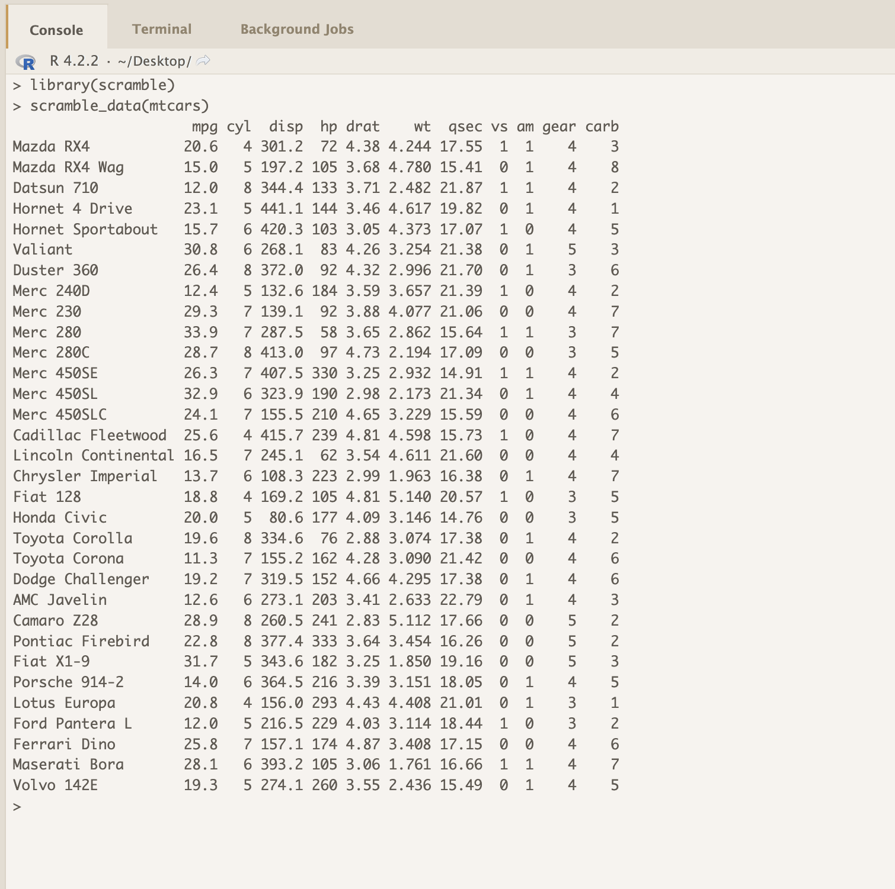

The scramble package provides tools for obfuscating data in data frames, matrixes, and vectors while
retaining data types and basic properties of the inputs (approximate NA proportions, approximate
minimum and maximum values for numeric data, approximate string lengths for character data, etc.).

The motivation for scramble comes from consulting situations in which someone is working with
sensitive data but has questions that doesn't require having the exact data values, just a data object
with similar properties to the true data. Most frequently, these are code-development and debugging
situations: The client is looking for advice on implementing a complex bootstrap, parallelizing a
procedure, etc.

In such situations, quickly generating and sharing a scrambled version of the data avoids the
delay and inconvenience of being added to a data-sharing agreement or research protocol.

For example:
 

 
Can become:
 

